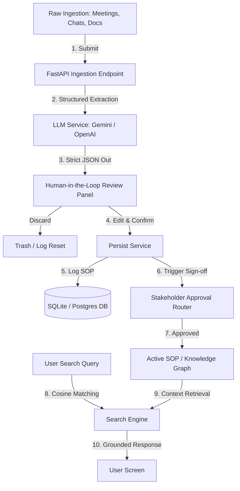
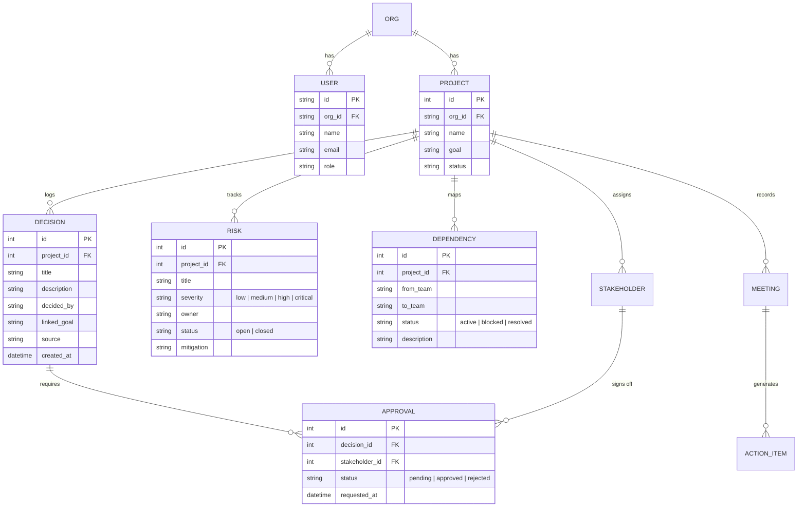

# ProductOS Case Study
## *Architecting an AI-Powered Organizational Intelligence & SOP Operating System*

This case study analyzes the architecture, database constraints, algorithms, and governance mechanisms of **ProductOS**—an enterprise platform designed to serve as the living memory and SOP operating system of modern organizations.

---

## 1. Executive Summary & Vision

Modern organizations struggle with **knowledge decay**. Process protocols, historical context, and critical decisions are buried in Slack threads, email channels, and meeting recordings. 

ProductOS operates as the **GitHub for organizational knowledge**. It continuously ingests unstructured conversations, extracts candidate operational records, subjects them to department-specific approval gates, and indexes them into a queryable semantic knowledge graph. 

### Key Systems Built
1. **Unstructured Context Ingestion & AI Extraction Engine**: Parses transcripts into structured models (Decisions, Risks, Action Items) using strict JSON validation schemas.
2. **Process Dependency Graph & Confidence Scoring**: Maps team handoffs and mathematically measures delivery health based on active blockers.
3. **Governance & Approval Routing State Machine**: Prevents AI hallucinations from entering the system of record by requiring human sign-off.
4. **Retrieval-Augmented Generation (RAG) Semantic Search**: Grounded Q&A indexing with SQLite-compatible fallback.

---

## 2. Technical System Architecture

The following diagram illustrates the flow of data from raw ingestion to verified, queryable organizational SOP assets:



---

## 3. Database Schema & Data Models

The relational database is configured to isolate data by **Organization (`Org`)** and **Project (`Project`)**. Below are the primary entities and constraints:



---

## 4. Core Algorithms

### 4.1 Delivery Confidence Scoring Engine
The platform calculates delivery risk programmatically by evaluating pending decisions, active risks, and blocked workflows. The score is computed using the following deduction formula:

$$\text{Confidence} = \max\left(0,\, 100 - (5D + 5M + 10H + 20C + 15B)\right)$$

Where:
* **$D$** = Count of Decisions awaiting pending approvals.
* **$M$** = Count of open **Medium** severity risks.
* **$H$** = Count of open **High** severity risks.
* **$C$** = Count of open **Critical** severity risks.
* **$B$** = Count of active **Blocked** cross-team dependencies.

### 4.2 Local Cosine Similarity Search Fallback
To enable zero-configuration local runs on SQLite, ProductOS uses a token-based Vector Space Model to calculate similarity scores over text documents:

1. **Tokenization**: Extract alphanumeric words and lowercase them:
   $$\text{Tokens}(T) = \{w_1, w_2, \dots, w_n\}$$
2. **Frequency Vectors**: Build document vectors $\vec{D}$ and query vectors $\vec{Q}$ based on term occurrences.
3. **Cosine Computation**:
   $$\text{Similarity}(D, Q) = \frac{\vec{D} \cdot \vec{Q}}{\|\vec{D}\| \|\vec{Q}\|} = \frac{\sum_{i} D_i Q_i}{\sqrt{\sum_{i} D_i^2} \sqrt{\sum_{i} Q_i^2}}$$

Documents with $\text{Similarity} > 0.05$ are fetched as citations, providing context for LLM response generation.

---

## 5. Governance Workflow State Machine

AI-generated processes can introduce operational errors if published directly. ProductOS enforces a multi-tier governance state machine:

```
[Meeting Transcript]
         │
         ▼ (AI Extraction)
   [Draft / Candidate]
         │
         ▼ (PM Edit & Confirm)
    [Pending State]  ─── (Auto-route approvals) ───► [Approval Checklist]
         │                                                    │
         ▼ (Review Gate)                                      ▼
[Rejected] ◄─── (Any Stakeholder Rejects) ─── [Pending Legal / Security / Eng]
                                                              │
         ┌────────────────────────────────────────────────────┘
         ▼ (All Stakeholders Approve)
 [Approved & Published] ──► (Updates Active SOP and Knowledge Base)
```

---

## 6. Key Engineering Trade-offs & Decisions

### 6.1 pgvector vs. SQLite Cosine Fallback
- **Trade-off**: Heavy database requirements vs. portable developer experience.
- **Decision**: Implemented an abstraction layer. If PostgreSQL with `pgvector` is available, the system executes vector distances. If run locally, the Python token similarity engine takes over. This allows immediate seeding and sandbox testing without complex setup.

### 6.2 In-Process Testing via TestClient
- **Trade-off**: Testing with real network calls (requires `uvicorn` setup) vs. in-process Starlette TestClient.
- **Decision**: Developed `tests/test_client.py` using `fastapi.testclient.TestClient`. It mocks requests instantly, allowing integration check validations to run inside CI pipelines without configuring port bindings or live sockets.
